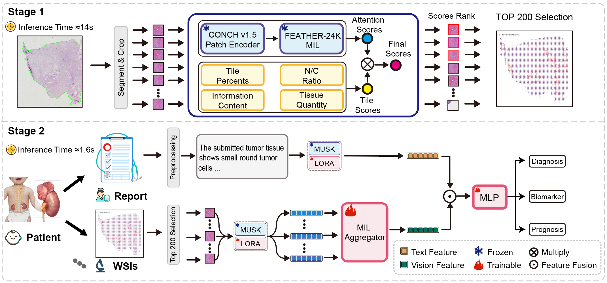

### 👉[Interactive Demo](https://nevademo.netlify.app/)
---
### 👥 Authors

<details>
<summary>Click to expand author list</summary>

Jin Zhu¹⁰‡, Ruizhen Hu²‡, Sen Yang¹³‡, Qing Sun⁵‡, Zhenzhen Zhao¹, Juan Cao⁶, Peiying Pan⁷, Kun Wang⁷, Liyan Cui⁸,
Hongping Tang⁹, Qianqian Fang¹, Sijin Jiang¹, Linli Lei¹, Wenjian Zhang¹, Jiajun Xie¹, Shuo Kang¹, Dongyuan Xiao¹,
Ming Xiao¹², Xuan Zhai¹, Yuntao Jia¹, Junyang Chen², Wei Yuan⁴, Xiao Han⁴, Junhan Zhao¹¹, Xiyue Wang³\*
Yi Li²\*, [Jinxi Xiang](https://jinxixiang.com/)³\*, Biyue Zhu¹\*

> ‡ Equal contribution · *Corresponding authors: [Biyue Zhu](mailto:biyuezhu@hospital.cqmu.edu.cn), [Jinxi Xiang](mailto:xiangjx@stanford.edu), [Yi Li](mailto:liyi@sz.tsinghua.edu.cn)*

</details>

---

### 🏥 Affiliations

<details>
<summary>Click to expand affiliations</summary>

1. Children’s Hospital of Chongqing Medical University, Chongqing, China
2. Shenzhen International Graduate School, Tsinghua University, Shenzhen, China
3. Department of Radiation Oncology, Stanford University School of Medicine, Palo Alto, USA
4. College of Biomedical Engineering, Sichuan University, Chengdu, China
5. Peking University First Hospital, Beijing, China
6. Shenzhen Children’s Hospital, Shenzhen, China
7. Guiyang Maternal and Child Health Care Hospital, Guiyang, China
8. Inner Mongolia Maternity and Child Health Care Hospital, Hohhot, China
9. Shenzhen Maternity and Child Healthcare Hospital, Southern Medical University, Shenzhen, China
10. Department of Pathology, Chongqing Medical University, China
11. Department of Biomedical Informatics, Harvard Medical School, Boston, USA
12. Molecular Medicine Diagnostic and Testing Center, Chongqing Medical University, China
13. Ant Group

</details>

---

## Overview


**NEVA** (**NE**uroblastoma **V**ision--language **A**I) is a unified foundation model trained on whole-slide histopathology images and pathology reports to perform 11 clinically essential tasks related to neuroblastoma diagnosis, biomarker prediction, and prognosis.

NEVA was trained and validated using the largest known multi-institutional neuroblastoma dataset to date:  

- **1,238 patients**  
- **1,419 pathology reports**  
- **3,593 whole-slide images (WSIs)**

It achieves robust performance over unimodal and conventional models in:  

- Classifying tumor **Risk Groups**, histologic **Subtypes**, **Mitotic-Karyorrhectic Index (MKI)**, and **Shimada classification**  
- Predicting molecular markers: **ALK**, **CMYC**, **1p36**, **11q23** and ***NMYC***. 
- Forecasting **Progression-Free Survival (PFS)** and **Overall Survival (OS)**  

> NEVA is scalable, interpretable, and data-efficient — a promising AI framework for precision neuroblastoma care across diverse clinical settings.

  
*NEVA pipeline*

---

## 🔧 Installation

1. Clone the repository:

    ```bash
    git clone https://github.com/ascklasn/NEVA.git
    cd NEVA
    ```

2. Create and activate the conda environment:

    ```bash
    conda env create -n NEVA -f environment.yml
    conda activate NEVA
    ```

---

## 🧪 WSI Preprocessing

The WSI preprocessing pipeline is adapted from [TRIDENT](https://github.com/mahmoodlab/TRIDENT). The official TRIDENT repository environment must be used for WSI preprocessing.

We recommend directly using the official TRIDENT repository for tile extraction and feature extraction with Patch-Level and Slide-Level foundation models (e.g., UNI, CONCH, Virchow, CHIEF, MUSK, etc.).

Please refer to the official repository for setup and usage instructions.

1. Navigate to the preprocessing directory:

    ```bash
    cd ./1_process_wsi
    ```

2. Extract features using [FEATHER](https://github.com/mahmoodlab/MIL-Lab) (refer to the official repository of Trident)

   ```python
   python run_batch_of_slides.py --task all --wsi_dir ./wsis --job_dir ./trident_processed --slide_encoder feather --mag 10 --patch_size 384
   ```

    - ```--wsi_dir ./wsis```: Path to dir with your WSIs.
    - ```--job_dir ./trident_processed```: Output dir for processed results.

3. Select TOP-200 Patches

   ```python
   python extract_patch_top.py --feat-root ./trident_processed/10x_384px_0px_overlap/slide_features_feather --output-dir ./top200_patches --wsi-root ./wsis
   ```

4. Output contents:
    - `top200_patches/<case_id>_top_patches/`: A folder containing up to 200 PNG images of TOP 200 patches.

---

## 💾 Model Weights Download

Download the model weights from the link below and place them in the `3_evaluation/neva_wts` folder.

| Task             | Performance     | Weights                                                                                        |
| ---------------- | --------------- | ---------------------------------------------------------------------------------------------- |
| Risk Group       | AUROC = 0.806   | [Download](https://drive.google.com/file/d/1g75iUeCsTXae_J3csr2O7UUUXRTaDZ2P/view?usp=sharing) |
| Subtype          | AUROC = 0.916   | [Download](https://drive.google.com/file/d/1rCxmsO5RNk-q8KLe4mlUW5dKhBpLqufJ/view?usp=sharing) |
| MKI              | AUROC = 0.791   | [Download](https://drive.google.com/file/d/11aHCpRlqcdt2WQ4peiPxywIiOL7cjH-P/view?usp=sharing) |
| Shimada          | AUROC = 0.823   | [Download](https://drive.google.com/file/d/1upOALcXuY6JYkdyPFydZwKTV6VLaog8D/view?usp=sharing) |
| ALK              | AUROC = 0.764   | [Download](https://drive.google.com/file/d/1g3uDkHVAUFzW5657grXOmgDiD5D0gtWA/view?usp=sharing) |
| NMYC             | AUROC = 0.924   | [Download](https://drive.google.com/file/d/1EU3C7845uZAbmcen4eqAqoqX8kuZhYin/view?usp=sharing) |
| CMYC             | AUROC = 0.703   | [Download](https://drive.google.com/file/d/18QO3jdP9jcWsRfwGkj1DKnwOhTrzypM-/view?usp=sharing) |
| 1p36 Deletion    | AUROC = 0.830   | [Download](https://drive.google.com/file/d/1v0G2Ytz_l9HmpiDzKtztfiTdkqcHkUN1/view?usp=sharing) |
| 11q23 Deletion   | AUROC = 0.776   | [Download](https://drive.google.com/file/d/1dnPoJxA2LaZGQG0D6esHeLHaDwa1kPZK/view?usp=sharing) |
| Overall Survival | C-index = 0.717 | [Download](https://drive.google.com/file/d/1Z_sPkAMqHHL6QGL5Bgmal7rVou2xZaDW/view?usp=sharing) |
| PFS              | C-index = 0.645 | [Download](https://drive.google.com/file/d/14UsRMndaSZSnVJ7nmiYJdB2Jpvm4eza7/view?usp=sharing) |

## 🏋️ How to use NEVA

First, you need to request access to the [MUSK](https://huggingface.co/xiangjx/musk) model on Hugging Face. Then, please refer to `3_evaluation/demo.ipynb` for an example.

---


## Acknowledgements

The project was built on many amazing open-source repositories: [TRIDENT](https://github.com/mahmoodlab/TRIDENT), [Feather](https://github.com/mahmoodlab/MIL-Lab), [MUSK](https://github.com/lilab-stanford/MUSK). We thank the authors and developers for their contributions.

## License

This model and associated code are released under the [MIT License](https://opensource.org/licenses/MIT).

## Citation
If you find our work helpful, feel free to give us a cite.
```bibtex
TODO

```