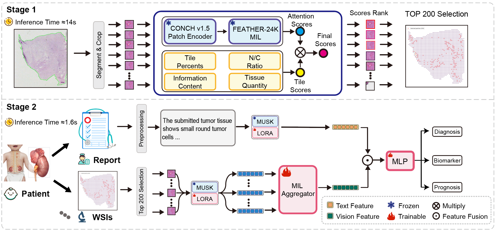

### 👉[Interactive Demo](https://nevademo.netlify.app/)
---
### 👥 Authors

<details>
<summary>Click to expand author list</summary>

Jin Zhu<sup>1,9‡</sup>, Ruizhen Hu<sup>2‡</sup>, Sen Yang<sup>3‡</sup>, Qing Sun<sup>4‡</sup>, Zhenzhen Zhao<sup>1</sup>, Juan Cao<sup>5</sup>, Peiying Pan<sup>6</sup>, Kun Wang<sup>6</sup>, Liyan Cui<sup>7</sup>, Hongping Tang<sup>8</sup>, Qianqian Fang<sup>1</sup>, Sijin Jiang<sup>1</sup>, Linli Lei<sup>1</sup>, Wenjian Zhang<sup>1</sup>, Jiajun Xie<sup>1</sup>, Shuo Kang<sup>1</sup>, Dongyuan Xiao<sup>1</sup>, Ming Xiao<sup>9</sup>, Xuan Zhai<sup>1</sup>, Yuntao Jia<sup>1</sup>, Junyang Chen<sup>2</sup>, Wei Yuan<sup>10</sup>, Xiao Han<sup>10</sup>, Le Lu<sup>3</sup>, Junhan Zhao<sup>11,12,13</sup>, Xiyue Wang<sup>14</sup>, Yi Li<sup>2*</sup>, Jinxi Xiang<sup>14*</sup>, Biyue Zhu<sup>1*</sup>

> ‡ Equal contribution · *Corresponding authors: [Biyue Zhu](mailto:biyuezhu@hospital.cqmu.edu.cn), [Jinxi Xiang](mailto:xiangjx@stanford.edu), [Yi Li](mailto:liyi@sz.tsinghua.edu.cn)*

</details>

---

### 🏥 Affiliations

<details>
<summary>Click to expand affiliations</summary>

1. Children’s Hospital of Chongqing Medical University, National Clinical Research Center for Child Health and Disorders, Ministry of Education Key Laboratory of Child Development and Disorders, China International Science and Technology Cooperation base of Child Development and Critical Disorders, Chongqing, China
2. Shenzhen International Graduate School, Tsinghua University, Shenzhen, China
3. Ant Group, Sunnyvale, CA, USA
4. Department of Pediatrics, Department of Pathology, Peking University First Hospital, Beijing, China
5. Department of Pathology, Shenzhen Children’s Hospital, Shenzhen, China
6. Guiyang Maternal and Child Health Care Hospital, Guiyang, China 
7. Pathology Department, Inner Mongolia Maternity and Child Health Care Hospital,  Hohhot, China
8. Department of Pathology, Shenzhen Maternity and Child Healthcare Hospital, Southern Medical University, Shenzhen, China
9. Department of Pathology, College of Basic Medicine, Chongqing Medical University, Molecular Medicine Diagnostic and Testing Center, Chongqing Medical University, Chongqing, China
10. College of Biomedical Engineering, Sichuan University, Chengdu, China
11. Department of Biomedical Informatics, Harvard Medical School, Boston, MA, USA
12. Department of Pediatrics, the University of Chicago, Chicago, IL, USA
13. Comprehensive Cancer Center, University of Chicago Medicine, Chicago, IL 60637, USA
14. Department of Radiation Oncology, Stanford University School of Medicine, Palo Alto, CA, USA

</details>

---

## Overview


**NEVA** (**NE**uroblastoma **V**ision--language **A**I) is a unified foundation model trained on whole-slide histopathology images and pathology reports to perform 11 clinically essential tasks related to neuroblastoma diagnosis, biomarker prediction, and prognosis.

NEVA was trained and validated using the largest known multi-institutional neuroblastoma dataset to date:  

- **1,238 patients**  
- **1,419 pathology reports**  
- **3,593 whole-slide images (WSIs)**

It achieves robust performance over unimodal and conventional models in:  

- Classifying tumor **Risk Groups**, histologic **Subtypes**, **Mitotic-Karyorrhectic Index (MKI)**, and **Shimada classification**  
- Predicting molecular markers: **ALK**, **CMYC**, **1p36**, **11q23** and ***NMYC***. 
- Forecasting **Progression-Free Survival (PFS)** and **Overall Survival (OS)**  

> NEVA is scalable, interpretable, and data-efficient — a promising AI framework for precision neuroblastoma care across diverse clinical settings.

  
*NEVA pipeline*

---

## 🔧 Installation

1. Clone the repository:

    ```bash
    git clone https://github.com/ascklasn/NEVA.git
    cd NEVA
    ```

2. Create and activate the conda environment:

    ```bash
    conda env create -n NEVA python=3.10
    conda activate NEVA
    pip install -r requirements.txt
    ```

---

## 🧪 WSI Preprocessing

The WSI preprocessing pipeline is adapted from [TRIDENT](https://github.com/mahmoodlab/TRIDENT). 

1. Navigate to the preprocessing directory:

    ```bash
    cd ./1_process_wsi
    ```

2. Extract features using [FEATHER](https://github.com/mahmoodlab/MIL-Lab) (refer to the official repository of Trident)

   ```python
   python run_batch_of_slides.py --task all --wsi_dir ./wsis --job_dir ./trident_processed --slide_encoder feather --mag 10 --patch_size 384
   ```

    - ```--wsi_dir ./wsis```: Path to dir with your WSIs.
    - ```--job_dir ./trident_processed```: Output dir for processed results.

3. Select TOP-200 Patches

   ```python
   python extract_patch_top.py --feat-root ./trident_processed/10x_384px_0px_overlap/slide_features_feather --output-dir ./top200_patches --wsi-root ./wsis
   ```

4. Output contents:
    - `top200_patches/<case_id>_top_patches/`: A folder containing up to 200 PNG images of TOP 200 patches.

---

## 💾 Model Weights Download

Download the model weights from the link below and place them in the `3_evaluation/neva_wts` folder.

| Task             | Performance     | Weights                                                                                        |
| ---------------- | --------------- | ---------------------------------------------------------------------------------------------- |
| Risk Group       | AUROC = 0.806   | [Download](https://drive.google.com/file/d/1PRkusD2nSe3ARoffPmvXZXjqJdnwBHDO/view?usp=drive_link) |
| Subtype          | AUROC = 0.916   | [Download](https://drive.google.com/file/d/1CVwRb7W-o17fC1qnWjzzHOb3roruCIP0/view?usp=drive_link) |
| MKI              | AUROC = 0.791   | [Download](https://drive.google.com/file/d/1MqAY9fCk0XR7llaN2_QMK7cxn3dea_Qp/view?usp=drive_link) |
| Shimada          | AUROC = 0.823   | [Download](https://drive.google.com/file/d/1IPSUTIcGiDcih5A85i2Kw1knrK2IQJtv/view?usp=drive_link) |
| ALK              | AUROC = 0.764   | [Download](https://drive.google.com/file/d/15J0aDWIiy3esNwYLWZyWdFAgVh5rhArB/view?usp=drive_link) |
| NMYC             | AUROC = 0.924   | [Download](https://drive.google.com/file/d/1QQd3Cncu_c_riu9cT7zFYf96Bf5ZCDDM/view?usp=drive_link) |
| CMYC             | AUROC = 0.703   | [Download](https://drive.google.com/file/d/1oqCu03t4z3TeLo11bFiBdYynP2MKoPyv/view?usp=drive_link) |
| 1p36             | AUROC = 0.830   | [Download](https://drive.google.com/file/d/18UgWL9c5Rs9HRrGAkGyH41vk0uGQNnG6/view?usp=drive_link) |
| 11q23            | AUROC = 0.776   | [Download](https://drive.google.com/file/d/1RC8zM4mIpytN6AUqYIHGynouW6NkT64P/view?usp=drive_link) |
| OS               | C-index = 0.717 | [Download](https://drive.google.com/file/d/1LyqfrpL_p53r1KKwr0wiYwTP-jXz9JkF/view?usp=drive_link) |
| PFS              | C-index = 0.645 | [Download](https://drive.google.com/file/d/1_Q6-yWI5z0rS9hlZTRAFfpoOXntXPwEX/view?usp=drive_link) |

## 🏋️ How to use NEVA

First, you need to request access to the [MUSK](https://huggingface.co/xiangjx/musk) model on Hugging Face. Then, please refer to `3_evaluation/demo.ipynb` for an example.

---


## Acknowledgements

The project was built on many amazing open-source repositories: [TRIDENT](https://github.com/mahmoodlab/TRIDENT), [Feather](https://github.com/mahmoodlab/MIL-Lab), [MUSK](https://github.com/lilab-stanford/MUSK). We thank the authors and developers for their contributions.

## License

This model and associated code are released under the [MIT License](https://opensource.org/licenses/MIT).

## Citation
If you find our work helpful, feel free to give us a cite.
```bibtex
@software{xiaohu_2026_neva,
  author    = {Ruizhen Hu and Jinxi Xiang},
  title     = {NEVA: A Unified Vision-Language Model for Precision Oncology and Biomarker Prediction in Neuroblastoma},
  year      = {2026},
  publisher = {Zenodo},
  version   = {v0.1},
  doi       = {10.5281/zenodo.19472116},
  url       = {https://doi.org/10.5281/zenodo.19472116}
}
```