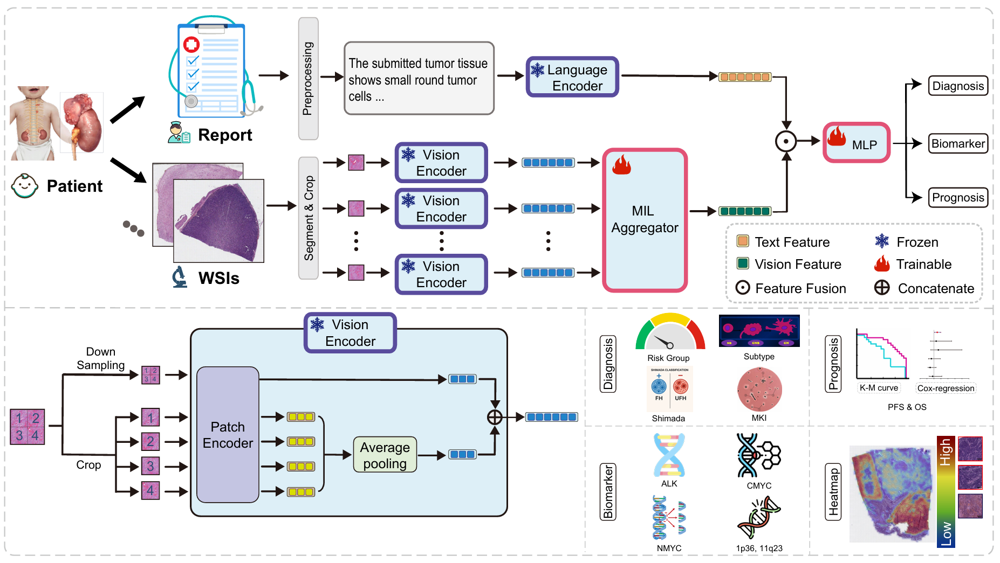

### 👥 Authors

<details>
<summary>Click to expand author list</summary>

Jin Zhu¹⁰‡, Ruizhen Hu²‡, Xiyue Wang³‡, Qing Sun⁵‡, Zhenzhen Zhao¹, Juan Cao⁶, Peiying Pan⁷, Kun Wang⁷, Liyan Cui⁸,
Hongping Tang⁹, Qianqian Fang¹, Sijin Jiang¹, Linli Lei¹, Wenjian Zhang¹, Jiajun Xie¹, Shuo Kang¹, Dongyuan Xiao¹,
Ming Xiao¹², Xuan Zhai¹, Yuntao Jia¹, Junyang Chen², Wei Yuan⁴, Xiao Han⁴, Junhan Zhao¹¹, Sen Yang³,
Yi Li²\*, Jinxi Xiang³\*, Biyue Zhu¹\*

> ‡ Equal contribution · *Corresponding authors: [Biyue Zhu](mailto:biyuezhu@hospital.cqmu.edu.cn), [Jinxi Xiang](mailto:xiangjx@stanford.edu), [Yi Li](mailto:liyi@sz.tsinghua.edu.cn)*

</details>

---

### 🏥 Affiliations

<details>
<summary>Click to expand affiliations</summary>

1. Children’s Hospital of Chongqing Medical University, Chongqing, China
2. Shenzhen International Graduate School, Tsinghua University, Shenzhen, China
3. Department of Radiation Oncology, Stanford University School of Medicine, Palo Alto, USA
4. College of Biomedical Engineering, Sichuan University, Chengdu, China
5. Peking University First Hospital, Beijing, China
6. Shenzhen Children’s Hospital, Shenzhen, China
7. Guiyang Maternal and Child Health Care Hospital, Guiyang, China
8. Inner Mongolia Maternity and Child Health Care Hospital, Hohhot, China
9. Shenzhen Maternity and Child Healthcare Hospital, Southern Medical University, Shenzhen, China
10. Department of Pathology, Chongqing Medical University, China
11. Department of Biomedical Informatics, Harvard Medical School, Boston, USA
12. Molecular Medicine Diagnostic and Testing Center, Chongqing Medical University, China

</details>


---

## Overview

**NEVA** (**NE**uroblastoma **V**ision--language **A**I) is a unified foundation model trained on whole-slide histopathology images and pathology reports to perform 11 clinically essential tasks related to neuroblastoma diagnosis, biomarker prediction, and prognosis.

NEVA was trained and validated using the largest known multi-institutional neuroblastoma dataset to date:  
- **1,070 patients**  
- **1,255 pathology reports**  
- **3,436 whole-slide images (WSIs)**  

It achieves robust performance over unimodal and conventional models in:  
- Classifying tumor **Risk Groups**, histologic **Subtypes**, **Mitotic-Karyorrhectic Index (MKI)**, and **Shimada classification**  
- Predicting molecular markers: **ALK**, **NMYC**, **CMYC**, **1p36**, and **11q23**  
- Forecasting **Progression-Free Survival (PFS)** and **Overall Survival (OS)**  

> NEVA is scalable, interpretable, and data-efficient — a promising AI framework for precision neuroblastoma care across diverse clinical settings.

  
*NEVA pipeline*

---

## 🔧 Installation

1. Clone the repository:
    ```bash
    git clone https://github.com/ascklasn/NEVA.git
    cd NEVA
    ```

2. Create and activate the conda environment:
    ```bash
    conda env create -n NEVA -f environment.yml
    conda activate NEVA
    ```

---

## 🧪 WSI Preprocessing

WSI preprocessing is adapted from [CLAM](https://github.com/mahmoodlab/CLAM).

1. Navigate to the preprocessing directory:
    ```bash
    cd ./1_process_wsi
    ```

2. Place `.svs` or other raw WSIs in the `./WSIs_source` folder.

3. Choose a config file from `./preset` and generate tiles, segmentation masks, thumbnails, and metadata:
    ```bash
    python gen_tiles.py --source ./WSIs_source --save_dir ./outputs --preset NEVA.csv --patch --seg --stitch
    ```

4. Output contents:
    - `patches/`: patch coordinates
    - `masks/`: segmented tissue masks
    - `stitches/`: thumbnail visualizations
    - `process_listautogen.csv`: record of segmentation/patching parameters

---

## 🔍 Feature Extraction

### 1. Patch-Level Feature Extraction (WSIs)

First, set paths:
```python
h5_root = "../1_process_wsi/outputs/patches"
slide_root = "../1_process_wsi/WSIs_source"
```

Then run:

```bash
python extract_image.py
```

> Output: `./outputs/images`

---

### 2. Textual Feature Extraction (Pathology Reports)

1. Place pathology reports in `pathology_report_en_eval.csv`.

2. Authenticate Hugging Face:

```python
my_token = 'hf_xxxxx'  # Replace with your token
login(my_token)
```

3. Run:

```bash
python extract_report.py
```

> Output: `./outputs/report_large`

---

## 🏋️ Training NEVA

1. Navigate to training directory:

   ```bash
   cd ./3_mil_classifier
   ```

2. Place your dataset CSV in `./workspace/datasets/`. Required columns:

   * `patient_id`, `case_id`, `task_label`, `filename`, `fold`

3. Run training script:

   ```bash
   python train_mil.py --type cls --task alk
   ```

> * `--type`: `cls` for classification, `reg` for Cox regression
> * `--task`: one of `alk`, `nmyc`, `cmyc`, `subtype`, etc.

> Output: model weights saved in `./workspace/models/`

---

## 💾 Pretrained Model Weights

Download the model weights and place them in:
`./NEVA/4_evaluation/model_weights/`

| Task             | Performance     | Weights                                                                                        |
| ---------------- | --------------- | ---------------------------------------------------------------------------------------------- |
| Risk Group       | AUROC = 0.898   | [Download](https://drive.google.com/file/d/1g75iUeCsTXae_J3csr2O7UUUXRTaDZ2P/view?usp=sharing) |
| Subtype          | AUROC = 0.933   | [Download](https://drive.google.com/file/d/1rCxmsO5RNk-q8KLe4mlUW5dKhBpLqufJ/view?usp=sharing) |
| MKI              | AUROC = 0.869   | [Download](https://drive.google.com/file/d/11aHCpRlqcdt2WQ4peiPxywIiOL7cjH-P/view?usp=sharing) |
| Shimada          | AUROC = 0.857   | [Download](https://drive.google.com/file/d/1upOALcXuY6JYkdyPFydZwKTV6VLaog8D/view?usp=sharing) |
| ALK              | AUROC = 0.877   | [Download](https://drive.google.com/file/d/1g3uDkHVAUFzW5657grXOmgDiD5D0gtWA/view?usp=sharing) |
| NMYC             | AUROC = 0.864   | [Download](https://drive.google.com/file/d/1EU3C7845uZAbmcen4eqAqoqX8kuZhYin/view?usp=sharing) |
| CMYC             | AUROC = 0.843   | [Download](https://drive.google.com/file/d/18QO3jdP9jcWsRfwGkj1DKnwOhTrzypM-/view?usp=sharing) |
| 1p36 Deletion    | AUROC = 0.831   | [Download](https://drive.google.com/file/d/1v0G2Ytz_l9HmpiDzKtztfiTdkqcHkUN1/view?usp=sharing) |
| 11q23 Deletion   | AUROC = 0.831   | [Download](https://drive.google.com/file/d/1dnPoJxA2LaZGQG0D6esHeLHaDwa1kPZK/view?usp=sharing) |
| Overall Survival | C-index = 0.793 | [Download](https://drive.google.com/file/d/1Z_sPkAMqHHL6QGL5Bgmal7rVou2xZaDW/view?usp=sharing) |
| PFS              | C-index = 0.743 | [Download](https://drive.google.com/file/d/14UsRMndaSZSnVJ7nmiYJdB2Jpvm4eza7/view?usp=sharing) |

---

## 📊 Evaluation

Run model evaluation in:

```bash
./4_evaluation/Model_Evaluation.ipynb
```
---

## 👁️ Visualization

The `configs` directory contains two files:  
- A *CSV* file with metadata for the samples  
- A *YAML* configuration file for visualization settings

### CSV File
The CSV file should include the following columns:

- `patient_id`
- `case_id`
- `label`
- `filename`
- `resolution`

You can refer to examples like:   `./configs/PUFH/pfs.csv`  


### YAML File
The YAML file specifies general visualization parameters. Example files:  `./configs/PUFH/pfs.yaml`  

Important fields under the `General` section include:

- `proj_name`: Task name, e.g., `pfs`, `os`, `shimada`, `subtype`, `alk`, `1p36`, `11q23`
- `proj_type`: `cls` for classification, `reg` for Cox regression
- `df_path`: Path to the corresponding CSV file containing sample metadata
- `pretrained_dir`: Path to the pretrained model weights for visualization, you can get pretrained weights for visualization from [Google Drive](https://drive.google.com/drive/folders/1ECvYZxsMM5zbBTfeMift3eNJLGFMgthW?usp=sharing)
- `patch_risk_heatmap`: Enable patch-level risk heatmap visualization
- `patch_attention_heatmap`: Enable patch-level attention heatmap visualization

### Running Visualization

```bash
cd ./5_visualization
python draw.py
```

---
